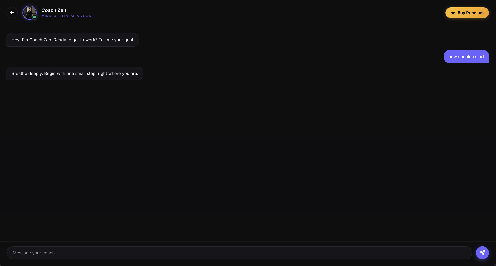
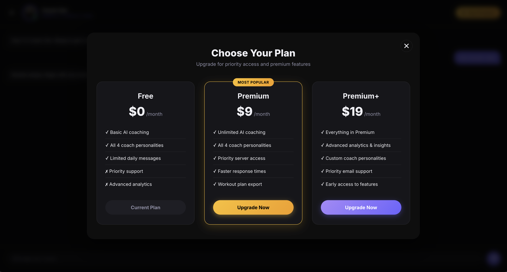
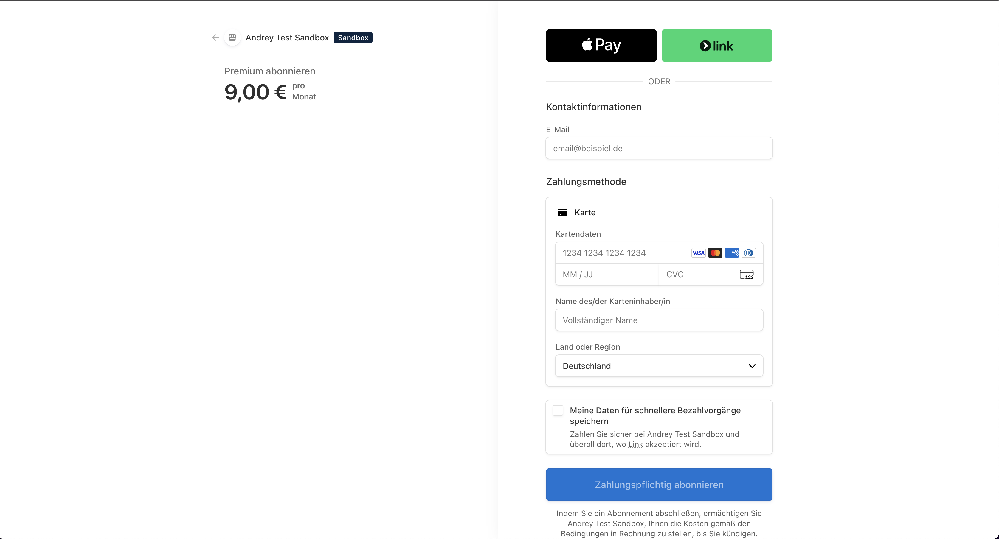

# 🏋️ GymCoach AI

An AI-powered fitness coaching platform that provides personalized workout guidance through intelligent chat assistants. Choose from multiple coaching personas, get real-time advice, and upgrade to premium for advanced features.

🌐 **Live Demo:** [gymcoach.andrey-petkov.com](https://gymcoach.andrey-petkov.com)

## ✨ Features

- **4 AI Coaching Personas** - Choose from Trainer, Nutritionist, Physiotherapist, or Motivator
- **Real-time Chat** - Get instant personalized fitness advice powered by Google Gemini AI
- **Premium Subscription** - Unlock advanced features with Stripe payments
- **Test Mode** - Try the payment flow with test cards before real transactions
- **Responsive Design** - Beautiful UI that works on all devices

## 📸 Screenshots

### Coach Selection


### AI Chat Interface


### Premium Pricing


### Stripe Payment


## 🛠️ Tech Stack

### Frontend
- **Angular 18** - Standalone components with signals
- **TypeScript** - Type-safe development
- **SCSS** - Custom styling with CSS variables
- **Vercel** - Production hosting

### Backend
- **Supabase Edge Functions** - Serverless API endpoints (Deno runtime)
- **Google Gemini AI** - Natural language processing for coaching
- **Stripe** - Secure payment processing
- **Webhooks** - Real-time payment verification

### Architecture
- **API Key Security** - All secrets hidden server-side in Supabase
- **Edge Functions** - Low-latency serverless compute
- **localStorage** - Premium status persistence

## 🚀 Getting Started

### Prerequisites
- Node.js 18+ and npm
- Supabase CLI (installed via Homebrew)
- Supabase account with project created
- Stripe account with test mode enabled
- Google Gemini API key

### Installation

1. **Clone the repository**
   ```bash
   git clone https://github.com/AndreyPetkov03/GymcoachAI.git
   cd GymcoachAI
   ```

2. **Install dependencies**
   ```bash
   npm install
   ```

3. **Configure environment**
   
   Update `src/environments/environment.ts`:
   ```typescript
   export const environment = {
     supabaseUrl: 'YOUR_SUPABASE_URL',
     supabaseKey: 'YOUR_SUPABASE_ANON_KEY',
     stripePublishableKey: 'YOUR_STRIPE_PUBLISHABLE_KEY'
   };
   ```

4. **Setup Supabase Edge Functions**
   
   Link your Supabase project:
   ```bash
   supabase link --project-ref YOUR_PROJECT_REF
   ```
   
   Set secrets in Supabase dashboard:
   ```
   GEMINI_API_KEY=your_gemini_api_key
   STRIPE_SECRET_KEY=your_stripe_secret_key
   STRIPE_PREMIUM_PRICE_ID=your_stripe_price_id
   STRIPE_WEBHOOK_SECRET=your_webhook_secret
   FRONTEND_URL=http://localhost:4200
   ```
   
   Deploy Edge Functions:
   ```bash
   export SUPABASE_ACCESS_TOKEN=your_access_token
   supabase functions deploy chat --no-verify-jwt
   supabase functions deploy create-checkout --no-verify-jwt
   supabase functions deploy webhook --no-verify-jwt
   ```

5. **Configure Stripe Webhook**
   - Go to Stripe Dashboard → Webhooks
   - Add endpoint: `https://YOUR_PROJECT.supabase.co/functions/v1/webhook`
   - Select event: `checkout.session.completed`
   - Copy webhook secret to Supabase secrets

6. **Start development server**
   ```bash
   ng serve
   ```
   
   Navigate to `http://localhost:4200/`

## 🧪 Testing Payments

Use Stripe's test cards in test mode:

- **Card Number:** 4242 4242 4242 4242
- **Expiry:** Any future date
- **CVC:** Any 3 digits
- **ZIP:** Any 5 digits

## 📦 Building for Production

```bash
ng build
```

Build artifacts will be in the `dist/` directory.

## 🌍 Deployment

### Vercel Deployment

1. Push code to GitHub
2. Import repository in Vercel
3. Configure build settings (Angular preset)
4. Deploy (no environment variables needed - they're in `environment.ts`)

### Post-Deployment

1. Update `FRONTEND_URL` in Supabase secrets to your production URL
2. Redeploy `create-checkout` function:
   ```bash
   supabase functions deploy create-checkout --no-verify-jwt
   ```

## 📁 Project Structure

```
gymcoach-ai/
├── src/
│   ├── app/
│   │   ├── pages/
│   │   │   └── home/          # Main landing page
│   │   └── services/
│   │       ├── gemini.ts      # AI chat service
│   │       └── stripe.ts      # Payment service
│   └── environments/
│       └── environment.ts     # Public configuration
├── supabase/
│   └── functions/
│       ├── chat/              # Gemini AI proxy
│       ├── create-checkout/   # Stripe checkout creator
│       └── webhook/           # Payment webhook handler
└── public/
    └── screenshots/           # App screenshots
```

## 🔒 Security

- All API keys stored server-side in Supabase Edge Function secrets
- Only public keys (Supabase anon key, Stripe publishable key) exposed in frontend
- Webhook signature verification for payment security
- JWT verification disabled for public Edge Functions

## 🤝 Contributing

Contributions are welcome! Please feel free to submit a Pull Request.

## 📄 License

This project is open source and available under the [MIT License](LICENSE).

## 👤 Author

**Andrey Petkov**
- GitHub: [@AndreyPetkov03](https://github.com/AndreyPetkov03)
- Website: [andrey-petkov.com](https://andrey-petkov.com)

## 🙏 Acknowledgments

- [Angular](https://angular.dev/) - Frontend framework
- [Supabase](https://supabase.com/) - Backend platform
- [Google Gemini](https://ai.google.dev/) - AI language model
- [Stripe](https://stripe.com/) - Payment processing
- [Vercel](https://vercel.com/) - Hosting platform
